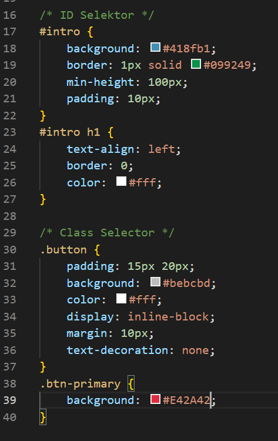

# Langkah - langkah Praktikum
1. Membuat dokumen HTML

- refresh browser

2. Mendeklarasikan CSS Internal

- refresh browser

3. Menambahkan Inline CSS

- refresh browser

4. Membuat CSS External

- Menambahkan file css pada tag <link> di bagian <head>

- refresh browser

5. Menambahkan CSS Selector

- refresh browser

### Pertanyaan dan Tugas
1. Lakukan eksperimen dengan mengubah dan menambah properti dan nilai pada kode CSS dengan mengacu pada CSS Cheat Sheet yang diberikan pada file terpisah dari modul ini.

2. Apa perbedaan pendeklarasian CSS elemen h1 {...} dengan #intro h1 {...}? berikan penjelasannya!

3. Apabila ada deklarasi CSS secara internal, lalu ditambahkan CSS eksternal dan inline CSS pada elemen yang sama. Deklarasi manakah yang akan ditampilkan pada browser? Berikan penjelasan dan contohnya!

4. Pada sebuah elemen HTML terdapat ID dan Class, apabila masing-masing selector tersebut terdapat deklarasi CSS, maka deklarasi manakah yang akan ditampilkan pada browser? Berikan penjelasan dan contohnya! ( 
 )

