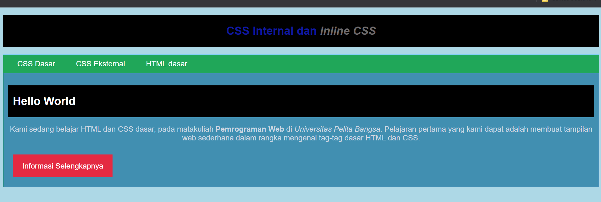
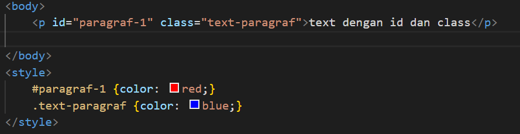

# Langkah - langkah Praktikum
### 1. Membuat dokumen HTML

- refresh browser

### 2. Mendeklarasikan CSS Internal


- refresh browser

### 3. Menambahkan Inline CSS

- refresh browser

### 4. Membuat CSS External

- Menambahkan file css pada tag <link> di bagian <head>

- refresh browser

### 5. Menambahkan CSS Selector

- refresh browser


# Pertanyaan dan Tugas
1. Lakukan eksperimen dengan mengubah dan menambah properti dan nilai pada kode CSS dengan mengacu pada CSS Cheat Sheet yang diberikan pada file terpisah dari modul ini.

- membuat background berwarna biru terang 


2. Apa perbedaan pendeklarasian CSS elemen h1 {...} dengan #intro h1 {...}? berikan penjelasannya!

- h1 menggunakan internal dan inline pada stylenya sedangkan intro menggunakan eksternal css style nya
- h1 contoh element selector, digunakan untuk memilih semua elemen HTML yang memiliki jenis elemen sama. contoh




- #intro h1 contoh descendant selector yang memiliki spasi untuk menunjukkan hirearki, digunakan untuk memilih semua elemen HTML sesuai pada hirearki tersebut. contoh


3. Apabila ada deklarasi CSS secara internal, lalu ditambahkan CSS eksternal dan inline CSS pada elemen yang sama. Deklarasi manakah yang akan ditampilkan pada browser? Berikan penjelasan dan contohnya!

- CSS Internal: diletakkan di bagian ```<head>```, prioritas sedang dan mengganti style external tetapi dapat diganti dengan style inline. contoh 

- CSS Eksternal: diletakkan di dalam file.css terpisah, mengurangi ukuran file HTML, prioritas terendah dan dapat diganti dengan style inline dan internal. contoh 

- CSS Inline: diletakkan di dalam tag HTML menggunakan atribut style, memiliki prioritas tertinggi dan menggantikan internal dan external. contoh 


4. Pada sebuah elemen HTML terdapat ID dan Class, apabila masing-masing selector tersebut terdapat deklarasi CSS, maka deklarasi manakah yang akan ditampilkan pada browser? Berikan penjelasan dan contohnya! ```(<p id="paragraf-1" class="text-paragraf"> )```




- deklarasi dengan ID memberikan warna merah dan deklarasi dengan Class memberikan warna biru. karena deklarasi dengan ID memiliki prioritas yang lebih tinggi maka akan memberikan warna merah